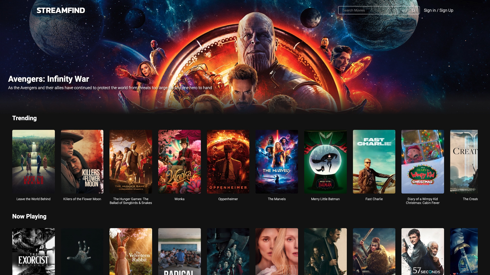
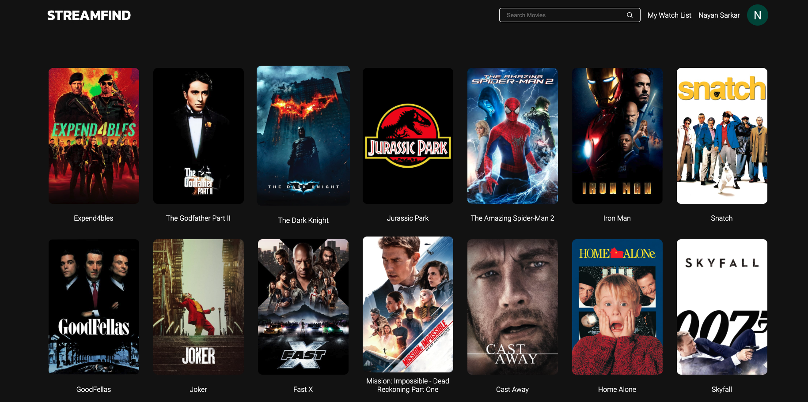
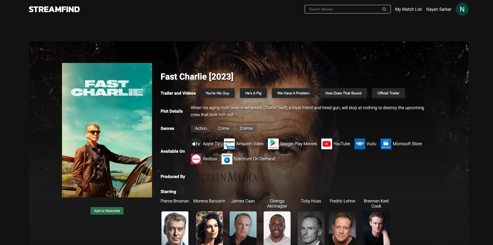
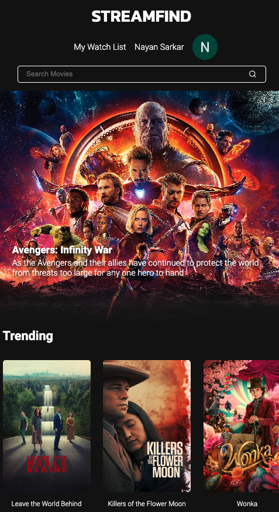

# Streamfind | Movie Search and Bookmark Site
A single page web app which allows users to find and bookmark movies available for streaming on different platforms

<b>Live Site:</b> https://streamfind.netlify.app

<b>Demo:</b> https://www.youtube.com/watch?v=bsYgQWqtaz4

## Built With
   

## Features
- Built with React 18 using Functional Components on the Frontend and Firestore Realtime Database on the Backend
- Authentication and Storage Operations handled with Custom React Hooks
- Full Responsive, compatible with Mobile, Tablet and Desktop screen sizes
- Page Routing with Route Protection done with React Router 6
- Deployed on Netlify with Firebase Authentication and Cloud Firestore Realtime NoSQL database
- Utilizes local storage to cache results, leading to faster load times and fewer API queries
- Powered with Netlify's serverless functions to query endpoints
- State Management across the entire app done through Context API with useReducer Hook

## Steps to Run Project Locally

- Install netlify cli in terminal `npm install netlify-cli -g`

- Sign Up for TMDB API Key `https://developer.themoviedb.org/`

- Create `.env` in project root directory 

- Add the line `VITE_SECRET_AUTHORIZATION = ""`

- Replace `""` in `env` file with value of `SECRET` in `Authorization: Bearer ${SECRET}` which is the Access Token Auth from TMDB API.  Refer serverless function in netlify/functions folder in project directory and Access Token Auth from `https://developer.themoviedb.org/reference/intro/getting-started`

- In terminal enter `npm install`

- In terminal enter `netlify dev`

## Screenshots

